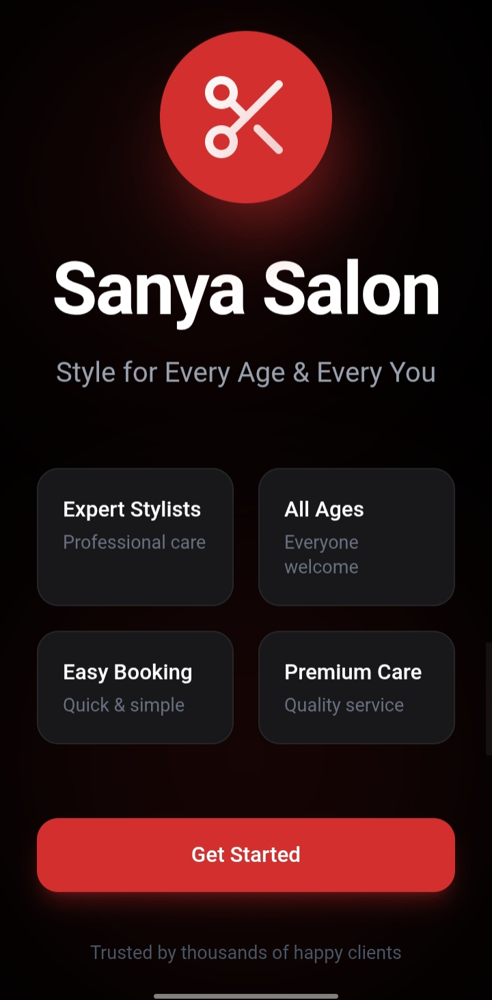

# FUTURE_UIUX_02
UI/UX Internship Task 2-Salon Booking Mobile App Design
# 💇‍♀️ Sanya Salon – Mobile App UI/UX Design

## 📱 Project Overview
This project is a mobile app UI design for a salon appointment booking system named "Sanya Salon".

The app is designed for all types of users including men, women, children, and senior citizens. It focuses on providing a simple, fast, and user-friendly booking experience.

---

## 🎯 Problem Statement
Users often face difficulties while booking salon appointments due to:
- Unclear time slot availability
- Lack of proper service details
- Complicated booking process

---

## 💡 Solution
A clean and intuitive mobile app UI was designed to:
- Simplify appointment booking
- Show real-time availability of slots
- Provide clear service details and pricing
- Improve overall user experience

---

## ✨ Key Features
- Service selection (Haircut, Facial, Spa)
- Different pricing based on:
  - Age (Child, Adult, Senior)
  - Duration (Short, Medium, Long)
- Service detail view (products used, method, duration)
- Stylist selection (Male & Female preference)
- Stylist availability (Available / On Leave)
- Real-time slot availability (Free / Booked)
- Slot availability percentage display
- Smart suggestions (Recommended time slots)
- Multiple payment options:
  - GPay
  - PhonePe
  - Debit/Credit Card
  - Cash
- Cancellation & refund system
- No-show handling with refund request
- Post-service review system

---

## 📱 Screens Included
- Welcome Screen
- Login / Signup Screen
- Services Screen
- Service Detail Screen
- Stylist Selection Screen
- Date & Time Booking Screen
- Payment Screen
- Appointment Confirmation Screen
- Review Screen

---

## 🎨 Design Style
- Dark theme (Black + Red)
- Clean and modern UI
- Rounded cards and soft shadows
- Large buttons for better accessibility

---

## 🧠 UX Decisions
- Simple booking flow to reduce user effort
- Clear CTA buttons (Book Now, Continue, Confirm)
- Visual distinction between available and booked slots
- Easy navigation for all age groups
- Real-world features like refund and stylist availability

---

## ⚙️ Tools Used
- Figma (UI/UX Design)
- GitHub (Documentation)

---

## 🔗 Figma Design Link
(Add your Figma link here)

---

## 📸 Screenshots

### Welcome Screen 

### Services Screen

### Booking Screen

### Payment Screen

### Confirmation Screen

